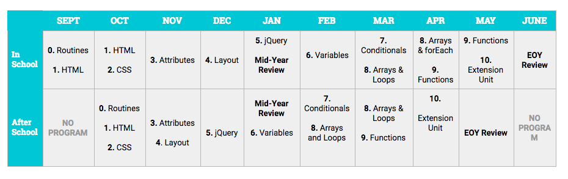

# Foundations Curriculum, 18-19

## Pacing Calendar

## Scope and Sequence

| Unit | Overview | Objectives   _Coders will..._ |
| :--- | :--- | :--- |
| [**1: Routines**](units/unit1.md) |  |  |
| [**2: HTML**](units/unit2.md) |  |  |
| [**3: CSS**](units/unit3.md) |  |  |
| [**4: HTML Attributes**](units/unit4.md) |  |  |
| [**5: Flexbox, Wireframing, Positioning, Layout**](units/unit5.md) |  |  |
| [**6: jQuery**](units/unit6.md) |  |  |
| [**Mid-Year Review Unit**](units/midyear.md) |  |  |
| [**7: Variables, Value Types, Operators, input.val**](units/unit7.md) |  |  |
| [**8: Conditionals**](units/unit8.md) |  |  |
| [**9: Arrays and forEach Loops**](units/unit9.md) |  |  |
| [**10: Functions**](units/unit10.md) |  |  |
| [**End-of-Year Wrap Up**](units/eoy_review_unit.md) |  |  |
| [**Extension Unit: Animations and Collisions**](units/extensions.md) |  |  |

### [Submit Your Feedback](https://docs.google.com/forms/d/e/1FAIpQLSeLpI-m6UKvIxk97F8R1iidFRaYXJ3dfcUuIjx2Pz0WMfO1SA/viewform)

## School Teacher Resources

* [CodeNation Teacher Liaison Curriculum Guide 18-19](https://docs.google.com/document/d/1IisBQOGlbDj1QBxcGtKrL-E5gZXhoUiumWlvkNHz8yg/edit): To be used in the CodeNation course that are co-taught with a teacher from the school.

**Curriculum content contributed by**: Dan Applegate, Matthew Brown, Vanessa Dean, Meghan Knoll, Sophat Sam, Scot Spinner, Tanya Trinkle, Jesse Wang, and Sarah Zinger

  
   
 Our curriculum is licensed under a [Creative Commons Attribution-NonCommercial 4.0 International License](http://creativecommons.org/licenses/by-nc/4.0/). 

