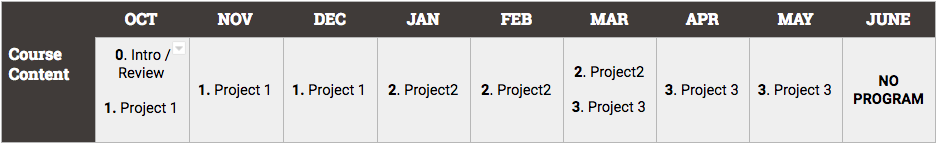

# Studio Curriculum, 18-19

## Pacing Guide

## Scope and Sequence

| Unit | Sessions | Overview |
| :--- | :---: | :--- |
| [**Welcome**](https://github.com/ScriptEdcurriculum/curriculum19-20/tree/c917a0e8850a879776ca762fe8cfa5cae6cde4a7/studio/units/unit0/README.md) | 1 | In this unit, coders will get to know their company, their instructors and their classmates.    Coders will review important routines, procedures and documents. Coders will complete a beginning of year challenge to review HTML, CSS, and Javascript from the Foundations and Advanced courses. |
| [**Project 1**](units/unit1.md) | 9 | In this unit, coders will work in pairs to build a project using HTML, CSS, JS and Firebase. Student will build and MVP for a project that takes in a user input, stores it in a database, then retrieves the data and displays it on the screen. This project is intended to highlight some important aspects of goal setting and project management. The project will culminate in a final presentation. |
| [**Project 2**](units/unit2.md) | 9 | In this unit, coders will work in pairs to build a project using HTML, CSS, React, and Firebase. Coders will follow the specifications to build out the front-end for the Kahoot style question game that displays a question and the possible answers, allows a user to choose answer and determine whether the are right or wrong. This project is intended to highlight some important aspects of goal setting and project management. The project will culminate in a final presentation. |
| **Project 3** | 9 | This unit is currently under construction. Please check back soon for updates. |

### [Submit Your Feedback](https://docs.google.com/forms/d/e/1FAIpQLSeLpI-m6UKvIxk97F8R1iidFRaYXJ3dfcUuIjx2Pz0WMfO1SA/viewform)

  As of 10/31/2018, ScriptEd has changed its name to Code Nation. Please bear with us as we make the transition!

For more information about Code Nation, please visit us at [codenation.org](https://www.codenation.org).   
   
 Our curriculum is licensed under a [Creative Commons Attribution-NonCommercial 4.0 International License](http://creativecommons.org/licenses/by-nc/4.0/). 

